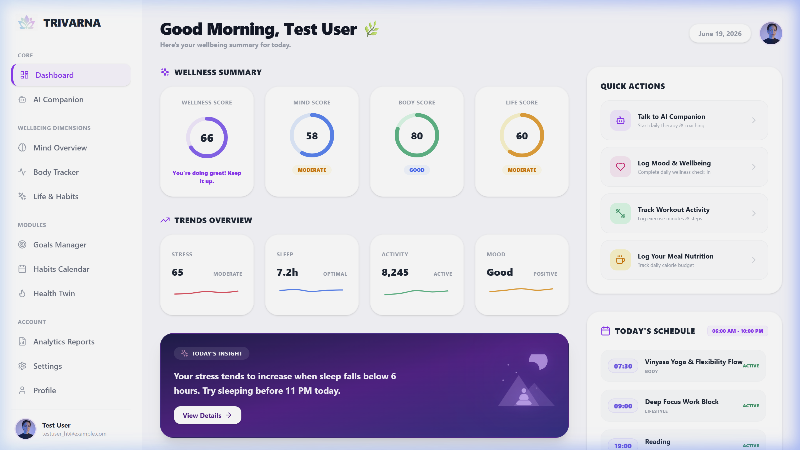
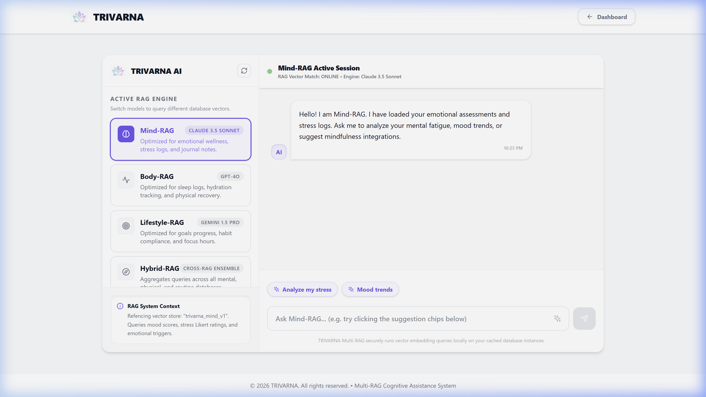
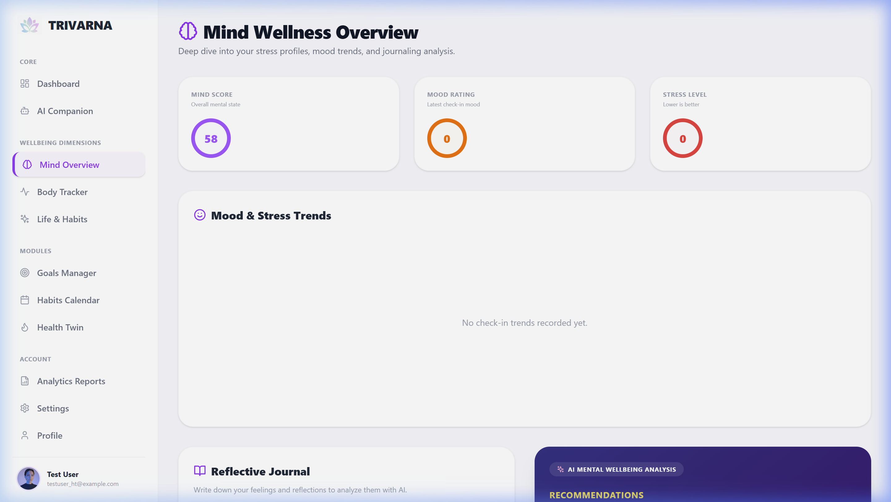
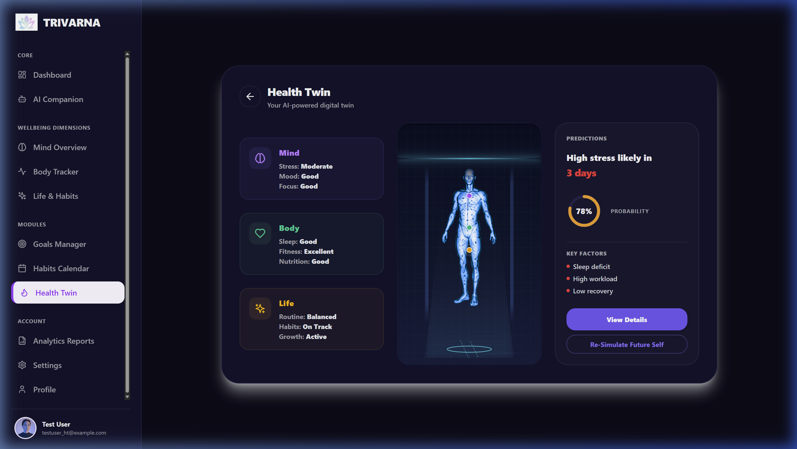
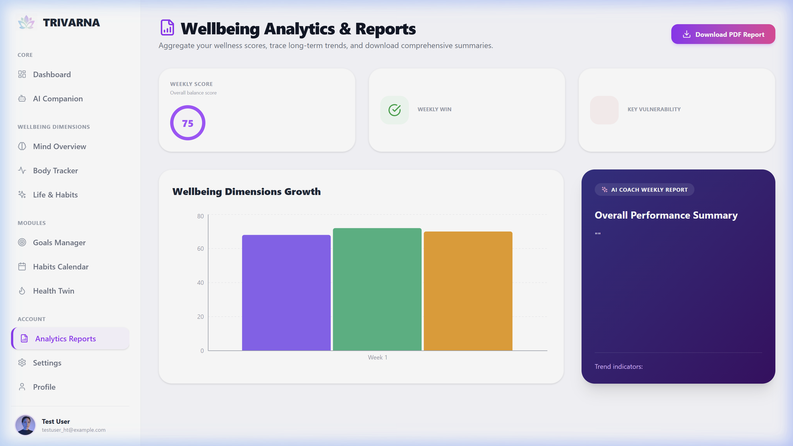

# TRIVARNA
### AI-Powered Mind · Body · Lifestyle Balance System

> **Balance Today. Thrive Tomorrow.**
>
> TRIVARNA is a premium, state-of-the-art wellness intelligence platform designed to harmonize the three pillars of human vitality: **Mind** (mental wellness and burnout prevention), **Body** (fitness, nutrition, and sleep tracking), and **Lifestyle** (habits, goals, and daily schedules). By combining real-time self-tracking with a Groq-powered AI pipeline and local ChromaDB vector databases, TRIVARNA delivers personalized wellness recommendations, adaptive schedules, and interactive 3D holographic forecasting of your future health.

---

## 🚀 Key Features

### 1. 📋 13-Step Personalized Onboarding
A comprehensive, interactive onboarding process that benchmarks user baselines:
* **Life Context & Emotional Baselines:** Capture occupations, stress drivers, and daily emotional states.
* **Biometric & Lifestyle Tracking:** Benchmark fitness levels, sleep durations, and nutritional targets.
* **Goals & Productive Windows:** Customize peak productive hours, focus areas, and personal milestones.
* **AI Wellness Roadmap:** Analyze responses to generate starting wellness scores (Mind, Body, Lifestyle) and formulate a customized daily roadmap.

### 2. 📊 Unified Wellness Command Center (Dashboard)
A premium dashboard offering immediate clarity on current health:
* **Real-time Scoring:** Modular indices for Mind, Body, and Lifestyle, aggregated into a master composite score.
* **Burnout Prediction Alert:** Warns users of potential burnout risks (Low, Medium, High) 3 to 5 days in advance based on historical stress and sleep patterns.
* **Daily Schedule block:** Generates dynamic hourly timelines dividing your day into 4 core focus blocks.
* **AI Wellness Coach Briefing:** Customized text summaries outlining what you should focus on today.

### 3. 🧠 Mind Module
Advanced emotional wellness tracking and stress management:
* **Sentiment Analysis Journaling:** Detects emotional tone and sentiment scores in real-time from journals.
* **Daily Mood & Stress Logging:** Correlates daily mental performance with external factors.
* **Stress & Burnout Predictive Modeling:** Evaluates stress, sleep hours, and energy logs to mitigate fatigue.

### 4. 👟 Body Hub
Comprehensive physical health tracking:
* **Fitness Tracker:** Log workouts, exercises, durations, and intensity levels.
* **Sleep Analytics:** Detailed logging of sleep cycles, duration, and restful states.
* **Nutrition Hub:** Tracks daily meals, calorie intake, water tracker (in liters), and nutritional targets.

### 5. 🎯 Lifestyle Manager
Systematize daily routines, habits, and long-term targets:
* **Habits Calendar:** Track consistency, check-off daily routines, and watch your consistency streaks grow.
* **Goals Manager:** Multi-category goal tracking with interactive progress bars.
* **Life Overview:** Renders your Life Balance radar and lets you analyze your progress holistically.

### 6. 💬 RAG-Powered AI Companion
An intelligent health coach that guides your wellness journey:
* **Multi-RAG Integration:** Context-aware conversations pulling from four specialized vector databases: Mind-RAG, Body-RAG, Lifestyle-RAG, and Hybrid-RAG.
* **Memory Recall Engine:** The companion learns your preferences, routines, and historical logs, recalling them during chat.
* **Fast Inference:** Running on Groq's LLaMA/Mixtral model arrays for sub-500ms response times.

### 7. 🧬 Holographic 3D Health Twin
Step into the future with an interactive virtual health preview:
* **3D Hologram Avatar:** Fully interactive mesh representing your current biological state.
* **Real-time Diagnostic Scanning:** Interactive scanning animations simulating biometric scans.
* **Multi-Timeline Health Forecasting:** Simulates your future physical and mental health levels across 30-day, 90-day, and 1-year timelines under different lifestyle scenarios.

---

## 🎨 Design System & Aesthetics

TRIVARNA is built to feel like an Apple WWDC Keynote combined with a premium SaaS startup pitch:
* **Color Palette:**
  * **Primary Hex:** `#6C4CF1` (Indigo/Purple)
  * **Secondary Hex:** `#8B6CFF` (Light Purple)
  * **Light Theme BG:** `#F8F7FF`
  * **Dark Theme BG:** `#13112B`
  * **Accent Cyan:** `#06B6D4` (AI and technical widgets)
  * **Success Green:** `#22C55E`
* **Layout:** Premium Glassmorphism cards, micro-animations, theme toggles, and responsive styling suited for desktop viewports.

---

## 📂 Visual Gallery

### Application Dashboard


### RAG AI Chatbot


### Mind Tracking & Stress Analysis


### 3D Holographic Health Twin


### Analytics and Wellness Reports


---

## 🏗️ Technical Stack

| Domain | Technologies |
| :--- | :--- |
| **Frontend Framework** | React 18, Vite 5, React Router v6 |
| **Styling & Icons** | TailwindCSS, Lucid-React |
| **State Management** | Zustand (Global App Stores) |
| **Data Visualization** | Recharts (Responsive Line, Bar, and Radar charts) |
| **Backend API** | FastAPI, Uvicorn |
| **Primary Database** | Supabase (PostgreSQL Client connection) |
| **Vector DB (RAG)** | ChromaDB (Persistent local vector storage) |
| **AI Inference** | Groq Cloud SDK (LLaMA-3.3-70b-versatile / Mixtral models) |

---

## 🗃️ Database Architecture

TRIVARNA uses a centralized relational layout tied directly to a single user profile.

```text
auth.users (Supabase Auth)
      │
      ▼
   profiles (Central Reference)
      │
      ├── onboarding_responses
      ├── profile_analysis
      ├── ai_plans
      ├── daily_checkins
      ├── journals
      ├── trivarna_scores
      ├── burnout_predictions
      ├── goals
      ├── habits
      │      └── habit_logs
      └── schedules
             └── schedule_tasks
```

### Table Dictionary
1. `profiles`: Basic user identification details (names, age, occupations).
2. `onboarding_responses`: Logs detailed step-by-step onboarding baselines.
3. `profile_analysis`: Standardized AI-evaluated wellness baseline scores.
4. `ai_plans`: Generative personalized plans including target sleep times and task lists.
5. `daily_checkins`: Tracks daily logs (mood, stress, sleep hours, productivity, water, exercise).
6. `journals`: User reflection logs with real-time sentiment analysis tracking.
7. `trivarna_scores`: Real-time computed wellness scores (Mind, Body, Lifestyle).
8. `burnout_predictions`: Analyzed burnout risk levels (Low, Medium, High).
9. `goals`: Wellness goals tracking progress and current status.
10. `habits`: User habits with categories and frequencies.
11. `habit_logs`: Records of completed habits per day.
12. `schedules`: Tracks generated calendar dates.
13. `schedule_tasks`: Renders hourly blocks (activities, durations, categories).

---

## ⚙️ Local Development Setup

To run TRIVARNA locally on your machine, follow these instructions:

### Prerequisites
* Python 3.10+
* Node.js 18+ & npm
* Supabase Account (for remote cloud persistence)
* Groq API Key (for LLM inference)

---

### Backend Configuration

1. **Navigate to the Backend Directory:**
   ```bash
   cd backend
   ```

2. **Create and Activate a Virtual Environment:**
   ```bash
   # Windows
   python -m venv venv
   .\venv\Scripts\activate

   # macOS/Linux
   python3 -m venv venv
   source venv/bin/activate
   ```

3. **Install Core Requirements:**
   ```bash
   pip install -r requirements.txt
   ```

4. **Setup Environment Variables:**
   Create a `.env` file in the root of the `/backend` folder and insert your keys:
   ```env
   SUPABASE_URL="YOUR_SUPABASE_PROJECT_URL"
   SUPABASE_KEY="YOUR_SUPABASE_API_ANON_KEY"
   GROQ_API_KEY="YOUR_GROQ_API_KEY"
   ```

5. **Start the FastAPI Server:**
   ```bash
   python -m uvicorn main:app --host 127.0.0.1 --port 8000 --reload
   ```
   * **API Docs URL:** [http://127.0.0.1:8000/docs](http://127.0.0.1:8000/docs)

---

### Frontend Configuration

1. **Navigate to the Frontend Directory:**
   ```bash
   cd ../frontend
   ```

2. **Install Package Dependencies:**
   ```bash
   npm install
   ```

3. **Setup Environment Variables (Optional):**
   Create a `.env` file in the root of the `/frontend` folder:
   ```env
   VITE_API_BASE_URL="http://127.0.0.1:8000"
   ```

4. **Start the Vite Development Server:**
   ```bash
   npm run dev
   ```
   * The app will spin up at [http://localhost:5173](http://localhost:5173).

---

## 🛠️ API Reference Summary

The FastAPI backend exposes the following router groups:

| Router | Method | Route | Description |
| :--- | :--- | :--- | :--- |
| **Auth** | `POST` | `/auth/signup` | Registers a new account |
| **Auth** | `POST` | `/auth/login` | Authenticates a user and returns JWT token |
| **Onboarding** | `POST` | `/onboarding/submit` | Saves 13-step assessment and runs initial analysis |
| **Dashboard** | `GET` | `/dashboard/{user_id}` | Fetches wellness scores, burnout status, and daily briefings |
| **Checkins** | `POST` | `/checkins` | Registers daily mood, stress, sleep, and physical logs |
| **Goals** | `POST` | `/goals` | Creates a new user goal |
| **Goals** | `GET` | `/goals/{user_id}` | Lists user goals with progress percentages |
| **Habits** | `POST` | `/habits` | Adds a new routine habit |
| **Habits** | `POST` | `/habits/logs` | Logs habit completion checkmarks |
| **Schedules** | `POST` | `/schedules/generate/{user_id}` | Invokes AI schedule optimizer to generate 4 daily blocks |
| **Chatbot** | `POST` | `/chatbot/chat` | Queries the AI Coach, utilizing ChromaDB memories and Groq |
| **Future Self** | `POST` | `/future-self/project` | Runs projections for the 3D Holographic Twin |

---

## 📄 Project Structure Directory Tree

```text
project/
├── backend/                  # FastAPI Python backend application
│   ├── ai/                   # AI clients and parameters
│   ├── core/                 # Configs, loggers, and middleware settings
│   ├── database/             # Supabase connection clients
│   ├── routers/              # Endpoint routing controllers (auth, chatbot, checks, etc.)
│   ├── schemas/              # Pydantic request & response validation shapes
│   ├── services/             # Business logics (analytics, predictions, RAG pipelines)
│   ├── main.py               # Main application entry point
│   ├── requirements.txt      # Python dependencies
│   └── .env                  # Backend credentials config
│
├── frontend/                 # React Vite single page application
│   ├── src/
│   │   ├── assets/           # UI media graphics and logos
│   │   ├── features/         # Chatbot component trees
│   │   ├── pages/            # Page controllers (dashboard, mind, body, healthtwin, etc.)
│   │   ├── services/         # Axios config backend calls
│   │   └── App.jsx           # Main routing assembly
│   ├── public/               # Holographic models, avatar textures, and screenshots (under /images)
│   └── index.html            # Main markup page
│
├── docs/                     # Comprehensive specifications
│   ├── ppt/                  # Python PowerPoint scripts and presentations
│   │   ├── Trivarna_v4_Final.pptx
│   │   └── PRESENTATION_NOTES.md
│   └── database-doc/         # Relational database logs
│
└── README.md                 # Current workspace index file
```

---

## 🛣️ Future Development Roadmap

### Q3 2026: Wearable Integrations
* Sync metrics with Fitbit, Garmin, and Apple Watch APIs to automate physical tracker updates.
* Live heart rate variability (HRV) analysis to optimize burnout prediction metrics.

### Q4 2026: Multi-Device Sync & Group Challenges
* Group challenges, accountability circles, and community leaderboards.
* Native iOS/Android companion app using React Native.

### Q1 2027: Deep Generative Sleep Soundscapes
* Generates personalized binaural audio wave patterns to improve deep sleep cycles based on mood scores.

---

## 📄 License
This project is licensed under the MIT License - see the LICENSE file for details.

---

## 💎 Acknowledgements
* **Groq Cloud API** for enabling ultra-low-latency wellness coaching insights.
* **Supabase** for robust cloud database synchronization.
* **ChromaDB** for efficient offline-friendly semantic RAG vector searches.
* **Recharts** for bringing wellness metrics to life with dynamic charts.
