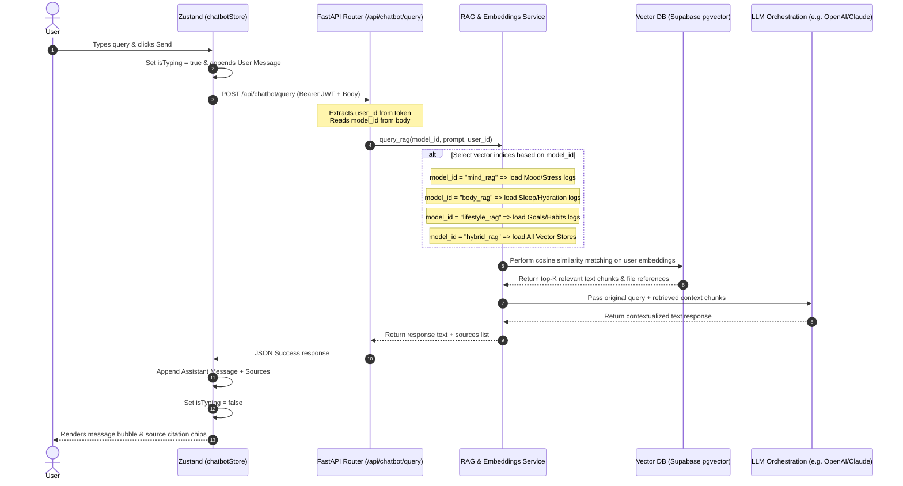

# TRIVARNA AI Assistant Chatbot Handoff Documentation

This document describes the frontend-only AI Assistant Chatbot UI developed for **TRIVARNA**. It has been designed as an isolated feature to support future Multi-RAG backend integration, with local mock databases and model-switching capabilities.

---

## 📂 Feature Folder Structure

To ensure merge safety and prevent disruptions to the core onboarding and dashboard files, all assets, state definitions, mock datasets, and React components are placed inside a dedicated chatbot directory:

```
src/features/chatbot/
├── Chatbot.jsx                # Main Chatbot page layout coordinator
├── components/
│   ├── ChatSidebar.jsx        # Sidebar managing model selections & active RAG stores
│   ├── ChatWindow.jsx         # Chat viewport scroll logs, suggestions, & message forms
│   ├── DatabasePanel.jsx      # Vector database indices indicators
│   ├── MessageBubble.jsx      # Chat bubbles for user prompts and assistant replies
│   ├── ModelSelector.jsx      # Radio-style button items for selecting active models
│   ├── SourceChips.jsx        # Horizontal citation tags showing databases retrieved
│   ├── SuggestionChips.jsx    # Floating query shortcuts tailored per model
│   └── TypingIndicator.jsx    # Bouncing-dot load indicators
├── data/
│   ├── mockConversations.js   # Predefined prompts, answers, and sources mapping
│   ├── ragModels.js           # RAG model definitions (engines, prompts, descriptions)
│   └── vectorDatabases.js     # Vector database indices mapped to models
└── store/
    └── chatbotStore.js        # Zustand store managing UI state and mock responses
```

---

## 🛠️ State Management (Zustand Store)

State is managed globally in [chatbotStore.js](file:///c:/Users/bsais/OneDrive/Desktop/aiml-ds/week%2022/project/frontend/src/features/chatbot/store/chatbotStore.js) and includes:

* **`selectedModel`** (`string`): Current active model selection. One of: `"mind_rag"`, `"body_rag"`, `"lifestyle_rag"`, `"hybrid_rag"`.
* **`isTyping`** (`boolean`): Tracks whether the mock response timer is active.
* **`messages`** (`array`): Tracks active message blocks. Messages contain:
  ```json
  {
    "id": "msg-12345-assistant",
    "sender": "assistant", // "user" or "assistant"
    "text": "Response markdown text content...",
    "timestamp": "11:32 AM",
    "sources": ["Mood Logs Index"] // string array of database sources (only for assistant)
  }
  ```
* **`activeDatabases`** (`array`): Stores database lists active for the selected model.

### Actions:
* **`setSelectedModel(modelId)`**: Swaps active RAG configuration, wipes chat history, and initializes the model-specific welcome prompt.
* **`sendMessage(text)`**: Adds user prompt to history, sets `isTyping = true`, waits `1000ms`, pulls the mock RAG response + citations, appends the response, and resets typing.
* **`clearHistory()`**: Restores the chat to its welcome prompt state.

---

## 📋 Mock Data Design & RAG Models

The chatbot represents **four models** matching the database team's updated SQL schema tables:

| Model ID | UI Name | LLM Engine | Vector Mappings (Mock Databases) | Key Suggestion Queries |
| :--- | :--- | :--- | :--- | :--- |
| **`mind_rag`** | Mind-RAG | Claude 3.5 Sonnet | `Mood Logs Index`, `journals Table`, `Stress Assessment Reports` | *Analyze my stress*, *Mood trends* |
| **`body_rag`** | Body-RAG | GPT-4o | `Sleep Logs Index`, `Hydration Intake Logs`, `Fitness & Exercise Trackers` | *Sleep quality*, *Hydration summary* |
| **`lifestyle_rag`** | Lifestyle-RAG | Gemini 1.5 Pro | `Active Goals Register`, `Habit Completion History`, `Productivity & Focus metrics` | *Productivity review*, *Habit consistency* |
| **`hybrid_rag`** | Hybrid-RAG | Cross-RAG Ensemble | `Unified TRIVARNA Vector Master` | *Generate life balance summary*, *Create balanced schedule* |

If the user types a custom query that is not covered by the preset chips, a **model-specific fallback response** is generated with standard citation indicators.

---

## 🚀 How to Integrate with Backend RAG APIs

This section outlines the handoff specifications for the backend team to build the corresponding RAG query APIs and how the frontend store should be refactored to consume them.

### 1. RAG Query Execution Flow (Mermaid Architecture)

Below is the diagram showing how the frontend selects a RAG model and sends a prompt, which the backend routes to the correct vector database indices:



---

### 2. Backend API Endpoint Specifications

The backend must expose a single gateway endpoint to process RAG queries.

#### Endpoint: `POST /api/chatbot/query`
* **Headers**:
  * `Authorization: Bearer <JWT_ACCESS_TOKEN>`
  * `Content-Type: application/json`

#### Request Body Payload Schema (Pydantic / JSON)
```json
{
  "model_id": "mind_rag", 
  "prompt": "Analyze my stress"
}
```
* **Validation**:
  * `model_id`: Required string. Must be one of: `mind_rag`, `body_rag`, `lifestyle_rag`, `hybrid_rag`.
  * `prompt`: Required string (non-empty).
  * *Note: The `user_id` should not be parsed from the body for security; it must be extracted in the authentication middleware by decoding the JWT.*

#### Response Body Schema (JSON)
```json
{
  "success": true,
  "reply": "Based on your recent stress assessment logs, your stress levels appear **moderate**...",
  "sources": [
    "Mood Logs Index", 
    "Stress Assessment Reports"
  ]
}
```

---

### 3. Frontend Store Refactoring Guide

To switch from local simulation to the live backend RAG API, refactor the `sendMessage` function in [chatbotStore.js](file:///c:/Users/bsais/OneDrive/Desktop/aiml-ds/week%2022/project/frontend/src/features/chatbot/store/chatbotStore.js#L30-L58) as follows:

```javascript
import { create } from 'zustand';
import axios from 'axios';
// (Keep other data imports as static assets for UI fallback/steppers)

export const useChatbotStore = create((set, get) => ({
  selectedModel: 'mind_rag',
  isTyping: false,
  messages: [getWelcomeMessage('mind_rag')],
  activeDatabases: VECTOR_DATABASES['mind_rag'],

  setSelectedModel: (modelId) => {
    set({
      selectedModel: modelId,
      messages: [getWelcomeMessage(modelId)],
      activeDatabases: VECTOR_DATABASES[modelId] || [],
      isTyping: false
    });
  },

  sendMessage: async (text) => {
    if (!text.trim()) return;

    const userMessage = {
      id: 'msg-' + Date.now() + '-user',
      sender: 'user',
      text,
      timestamp: new Date().toLocaleTimeString([], { hour: '2-digit', minute: '2-digit' }),
      sources: []
    };

    set((state) => ({
      messages: [...state.messages, userMessage],
      isTyping: true
    }));

    try {
      // 1. Fetch the active user session token (e.g., from authStore or localStorage)
      const token = localStorage.getItem('access_token'); 
      
      // 2. Perform the API call to the live FastAPI gateway
      const response = await axios.post('http://127.0.0.1:8000/api/chatbot/query', {
        model_id: get().selectedModel,
        prompt: text
      }, {
        headers: {
          'Authorization': `Bearer ${token}`,
          'Content-Type': 'application/json'
        }
      });

      const assistantMessage = {
        id: 'msg-' + Date.now() + '-assistant',
        sender: 'assistant',
        text: response.data.reply,
        timestamp: new Date().toLocaleTimeString([], { hour: '2-digit', minute: '2-digit' }),
        sources: response.data.sources || []
      };

      set((state) => ({
        messages: [...state.messages, assistantMessage],
        isTyping: false
      }));

    } catch (error) {
      console.error("RAG Query failed:", error);
      
      const errorMessage = {
        id: 'msg-' + Date.now() + '-error',
        sender: 'assistant',
        text: "Sorry, I encountered an issue querying your vector stores. Please ensure the backend server is running and try again.",
        timestamp: new Date().toLocaleTimeString([], { hour: '2-digit', minute: '2-digit' }),
        sources: []
      };

      set((state) => ({
        messages: [...state.messages, errorMessage],
        isTyping: false
      }));
    }
  }
}));
```

---

### 4. Database Schema for Chat History & Vectors (Supabase/PostgreSQL)

To support persistent chat history and document retrieval, the backend team should execute the following SQL scripts in the Supabase SQL editor.

#### A. Chat Messages Log Table
This table stores the conversational logs between users and their AI assistant chatbot configurations:

```sql
-- Create table for storing chat logs
CREATE TABLE IF NOT EXISTS chat_messages (
    id UUID PRIMARY KEY DEFAULT gen_random_uuid(),
    user_id UUID NOT NULL REFERENCES auth.users(id) ON DELETE CASCADE,
    sender TEXT NOT NULL CHECK (sender IN ('user', 'assistant')),
    text TEXT NOT NULL,
    sources TEXT[] DEFAULT '{}',
    model_id TEXT NOT NULL,
    created_at TIMESTAMPTZ DEFAULT NOW()
);

-- Enable Row Level Security (RLS)
ALTER TABLE chat_messages ENABLE ROW LEVEL SECURITY;

-- Create policies for RLS security mapping
CREATE POLICY "Users can insert their own chat messages" 
ON chat_messages FOR INSERT 
TO authenticated 
WITH CHECK (auth.uid() = user_id);

CREATE POLICY "Users can view only their own chat messages" 
ON chat_messages FOR SELECT 
TO authenticated 
USING (auth.uid() = user_id);

CREATE POLICY "Users can delete only their own chat history" 
ON chat_messages FOR DELETE 
TO authenticated 
USING (auth.uid() = user_id);
```

#### B. Document Embeddings Table (pgvector)
If the database team uses Supabase's built-in `pgvector` extension, they should enable the extension and set up a document chunks storage schema:

```sql
-- Enable the pgvector extension to allow vector similarity searches
CREATE EXTENSION IF NOT EXISTS vector;

-- Create vector document store
CREATE TABLE IF NOT EXISTS user_logs_embeddings (
    id UUID PRIMARY KEY DEFAULT gen_random_uuid(),
    user_id UUID NOT NULL REFERENCES auth.users(id) ON DELETE CASCADE,
    content TEXT NOT NULL,                  -- Text segment context
    embedding VECTOR(1536),                  -- Dimensions for standard models (e.g. text-embedding-3-small)
    source_database TEXT NOT NULL,          -- The target database index (e.g., 'Mood Logs Index')
    created_at TIMESTAMPTZ DEFAULT NOW()
);

-- Enable Row Level Security (RLS)
ALTER TABLE user_logs_embeddings ENABLE ROW LEVEL SECURITY;

CREATE POLICY "Users can view only their own embeddings"
ON user_logs_embeddings FOR SELECT
TO authenticated
USING (auth.uid() = user_id);
```

---

### 5. Backend Authentication & JWT Verification (FastAPI Dependency)

FastAPI can decode and verify Supabase JWT access tokens directly via the standard header authentication scheme:

```python
from fastapi import Depends, HTTPException, status
from fastapi.security import HTTPBearer, HTTPAuthorizationCredentials
from database.supabase_client import supabase

security = HTTPBearer()

async def get_current_user(credentials: HTTPAuthorizationCredentials = Depends(security)):
    """
    Dependency that decodes the Bearer JWT token from the Authorization header 
    using the Supabase client API to authenticate the user session.
    """
    token = credentials.credentials
    try:
        # Calls the Supabase auth API to verify the JWT and return user details
        user_response = supabase.auth.get_user(token)
        if not user_response or not user_response.user:
            raise HTTPException(
                status_code=status.HTTP_401_UNAUTHORIZED,
                detail="Invalid or expired access token"
            )
        return user_response.user
    except Exception as e:
        raise HTTPException(
            status_code=status.HTTP_401_UNAUTHORIZED,
            detail=f"Could not validate credentials: {str(e)}"
        )
```

---

### 6. Supabase Vector Similarity Search Function (pgvector)

Instead of pulling all embedding vectors to Python memory and performing similarity math in Python, the database team should deploy a database stored procedure (`RPC`) in PostgreSQL to run the calculations directly in the database:

```sql
CREATE OR REPLACE FUNCTION match_user_embeddings (
  query_embedding vector(1536),
  match_threshold float,
  match_count int,
  filter_user_id uuid,
  filter_sources text[]
)
RETURNS TABLE (
  id uuid,
  content text,
  source_database text,
  similarity float
)
LANGUAGE plpgsql
AS $$
BEGIN
  RETURN QUERY
  SELECT
    user_logs_embeddings.id,
    user_logs_embeddings.content,
    user_logs_embeddings.source_database,
    1 - (user_logs_embeddings.embedding <=> query_embedding) AS similarity
  FROM user_logs_embeddings
  WHERE user_logs_embeddings.user_id = filter_user_id
    AND user_logs_embeddings.source_database = ANY(filter_sources)
    AND 1 - (user_logs_embeddings.embedding <=> query_embedding) > match_threshold
  ORDER BY user_logs_embeddings.embedding <=> query_embedding
  LIMIT match_count;
END;
$$;
```

---

### 7. Complete Python FastAPI Router Implementation

Below is a complete FastAPI router template for the backend team showing how to parse queries, resolve user identities, perform vector similarity fetches, format LLM prompts, and insert history logs into Supabase:

```python
from fastapi import APIRouter, Depends, HTTPException, status
from pydantic import BaseModel
from typing import List, Optional
from database.supabase_client import supabase
# Import the authentication dependency
from routers.auth import get_current_user

router = APIRouter(
    prefix="/chatbot",
    tags=["AI Assistant Chatbot"]
)

class ChatQueryRequest(BaseModel):
    model_id: str
    prompt: str

class ChatQueryResponse(BaseModel):
    success: bool
    reply: str
    sources: List[str]

@router.post("/query", response_model=ChatQueryResponse)
async def query_chatbot(
    payload: ChatQueryRequest,
    current_user: dict = Depends(get_current_user)
):
    try:
        user_id = current_user.id
        
        # 1. Map model_id to specific database indexes
        model_sources_map = {
            "mind_rag": ["Mood Logs Index", "journals Table", "Stress Assessment Reports"],
            "body_rag": ["Sleep Logs Index", "Hydration Intake Logs", "Fitness & Exercise Trackers"],
            "lifestyle_rag": ["Active Goals Register", "Habit Completion History", "Productivity & Focus metrics"],
            "hybrid_rag": [
                "Mood Logs Index", "journals Table", "Stress Assessment Reports",
                "Sleep Logs Index", "Hydration Intake Logs", "Fitness & Exercise Trackers",
                "Active Goals Register", "Habit Completion History", "Productivity & Focus metrics"
            ]
        }
        
        active_sources = model_sources_map.get(payload.model_id)
        if not active_sources:
            raise HTTPException(
                status_code=400,
                detail=f"Invalid model_id: {payload.model_id}"
            )

        # 2. Insert User Prompt into DB History log
        supabase.table("chat_messages").insert({
            "user_id": str(user_id),
            "sender": "user",
            "text": payload.prompt,
            "model_id": payload.model_id,
            "sources": []
        }).execute()

        # 3. Vector Similarity Search Step (Example pseudocode)
        # Note: In production, generate query embeddings using openai or another embedding package:
        # query_embedding = generate_embedding(payload.prompt)
        # search_response = supabase.rpc("match_user_embeddings", {
        #     "query_embedding": query_embedding,
        #     "match_threshold": 0.5,
        #     "match_count": 3,
        #     "filter_user_id": str(user_id),
        #     "filter_sources": active_sources
        # }).execute()
        # retrieved_contexts = search_response.data or []

        # 4. Formulate Prompt & Query LLM Orchestrator
        # system_prompt = "You are TRIVARNA wellness assistant. Use this user history data to answer..."
        # llm_reply = call_llm(system_prompt, retrieved_contexts, payload.prompt)
        
        # Simulated RAG response based on selected model (placeholder for LLM response)
        llm_reply = f"Hello! I have reviewed your loaded data sources ({', '.join(active_sources)}) for the {payload.model_id.upper()} configuration. Based on this historical context, everything looks stable."

        # 5. Insert Assistant Response into DB History log
        supabase.table("chat_messages").insert({
            "user_id": str(user_id),
            "sender": "assistant",
            "text": llm_reply,
            "model_id": payload.model_id,
            "sources": active_sources
        }).execute()

        return {
            "success": True,
            "reply": llm_reply,
            "sources": active_sources
        }

    except Exception as e:
        raise HTTPException(
            status_code=500,
            detail=f"Internal RAG query processing failed: {str(e)}"
        )

@router.get("/history/{model_id}")
async def get_chat_history(
    model_id: str,
    current_user: dict = Depends(get_current_user)
):
    """
    Retrieves the chronological list of past messages for a specific model configuration.
    """
    try:
        user_id = current_user.id
        response = supabase.table("chat_messages") \
            .select("*") \
            .eq("user_id", str(user_id)) \
            .eq("model_id", model_id) \
            .order("created_at", desc=False) \
            .execute()

        formatted_messages = []
        for msg in response.data:
            formatted_messages.append({
                "id": str(msg["id"]),
                "sender": msg["sender"],
                "text": msg["text"],
                "timestamp": msg["created_at"].strftime("%I:%M %p") if hasattr(msg["created_at"], "strftime") else str(msg["created_at"]),
                "sources": msg["sources"]
            })
        return {
            "success": True,
            "messages": formatted_messages
        }
    except Exception as e:
        raise HTTPException(
            status_code=500,
            detail=f"Could not load chat history: {str(e)}"
        )
```

---

## 🏃 How to Run the Chatbot Frontend Separately

To run, inspect, or build the **AI Assistant Chatbot** feature in isolation from the rest of the application, follow these steps:

### Option A: Route-Based Separation (Standard Dev Server)
The quickest way to test the Chatbot without navigating through the onboarding process is using the development server router:
1. Start the frontend development server if not already running:
   ```bash
   cd frontend
   npm run dev
   ```
2. Navigate directly to the chatbot route in your browser:
   * **URL**: [http://localhost:3000/chatbot](http://localhost:3000/chatbot)

### Option B: Standalone Component Isolation (App Entrypoint)
If you want to render **only** the Chatbot component on the port (completely bypassing the AppRoutes router, navigation header, and onboarding dependencies):
1. Open [App.jsx](file:///c:/Users/bsais/OneDrive/Desktop/aiml-ds/week%2022/project/frontend/src/App.jsx).
2. Modify the file to mount the Chatbot directly:
   ```javascript
   import React from 'react';
   import Chatbot from './features/chatbot/Chatbot';
   import './styles/index.css';

   export default function App() {
     return <Chatbot />;
   }
   ```
3. Run `npm run dev`. The server at `http://localhost:3000` will load the Chatbot layout as the root page.

---

## 🔒 Merge Safety & Scope Isolation

* **Touched Files**: Only [AppRoutes.jsx](file:///c:/Users/bsais/OneDrive/Desktop/aiml-ds/week%2022/project/frontend/src/routes/AppRoutes.jsx) was modified to append `/chatbot` to the router and introduce a navigation button on the Dashboard.
* **Isolated Folders**: All component logic, data structures, and styling resides strictly in the `src/features/chatbot` subdirectory. No onboarding screens, style guidelines, or auth structures were modified, ensuring full independence of the chatbot.


